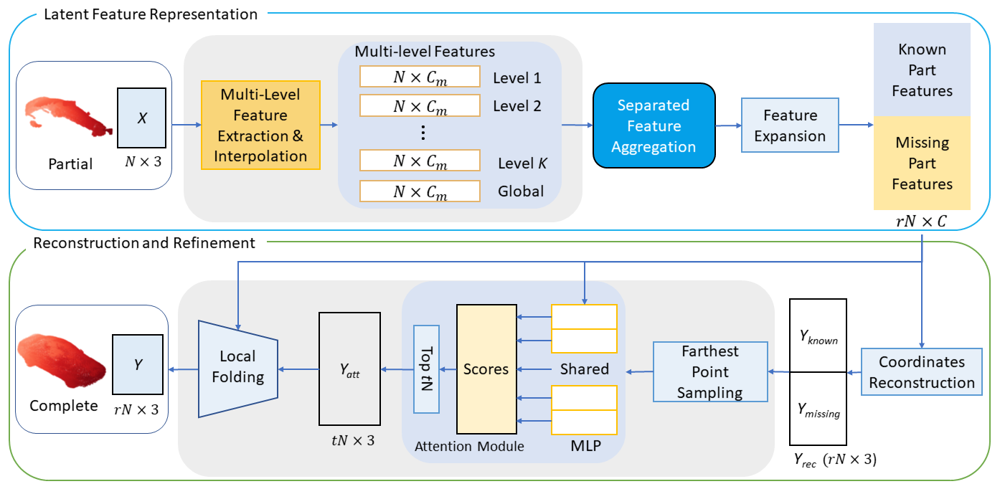

# Detail Preserved Point Cloud Completion via Separated Feature Aggregation

**[Detail Preserved Point Cloud Completion via Separated Feature Aggregation](https://arxiv.org/abs/1904.09793)** CVPR 2019

Wenxiao Zhang, Qingan yan and Chunxia Xiao

Wuhan University; JD.com American Technologies Corporation, CA
## Introduction
We propose a point cloud completion framework which leverages separated feature aggregation to reconstruct the known and the missing part separately.
This work is based on [PU-Net](https://github.com/yulequan/PU-Net) and [PCN](https://github.com/wentaoyuan/pcn).

### 1) Pre-requisites
* Python3
* CUDA
* tensorflow<2.0
* tensorpack
* matplotlib
* lmdb
* msgpack
* pyarrow
* open3d-python

This code is built using Tensorflow 1.14 with CUDA 10.0 and tested on Ubuntu 18.04 with Python 3.6.

### 2)Compile Customized TF Operators
The TF operators are included under `tf_ops` and `pc_distance`, you need to compile them. Check the `makefile` under `pc_distance` folder and `compile.sh` under `tf_ops`. (You need to check the the CUDA path and tensorflow path in each tf_xxx_compile_abs.sh under each tf_ops subfolder) first. Refer to [Pointnet++](https://github.com/charlesq34/pointnet2) for more details.

**Important**: We modified the original source code `gather_point` function in `tf_sampling.cpp` and `tf_sampling_g.cu` to fit our needs. If you have already complied the sampling operator in other project, you need to recompile it.

### 3)Download pre-trained models
Download pre-trained models on `trained_models` folder from [Google Drive](https://drive.google.com/drive/folders/1-2gU_d2u3JH-N4vHhEEvuQ-ggzA4Xb93?usp=sharing) and put them on `data/trianed_models` dir. The pre-trained models consist networks of RFA and GLFA.

### 4) Testing

1. Download ShapeNet test data on [Google Drive](https://drive.google.com/drive/folders/1W0ASe-EWNtlweBzu5t8V7hUULDDw6gTc?usp=sharing). Specifically, this experiment requires `test.lmdb` and `test_novel.lmdb`. Put them on `data/shapenet` folder.
2. Run `python3 eval.py`. Use `--model_type` option to choose different model architectures. Use `--save_path` option to choose the folder to save the qualitative results. If you just want to see the quantitative results, you can set `--plot` to `False` for fast evaluation.

Note that we use the same testing data in [PCN](https://www.cs.cmu.edu/~wyuan1/pcn/) project but we create the lmdb file for faster evaluation. You can also use the original pcd file provided on [PCN repository](https://github.com/wentaoyuan/pcn).

### 5) Traning

1. The training data are from [PCN repository](https://github.com/wentaoyuan/pcn), you can download training (`train.lmdb`, `train.lmdb-lock`) and validation (`valid.lmdb`, `valid.lmdb-lock`) data from `shapenet` or `shapenet_car` directory on the provided training set link in PCN repository. Note that the training data for all 8 categories in `shapenet` takes up 49G of disk space. The training data for only the car category takes 9G instead.
2. Run `python3 train.py`. Use `--model_type` option to choose different model architectures. Type `python3 train.py -h` for more options.
